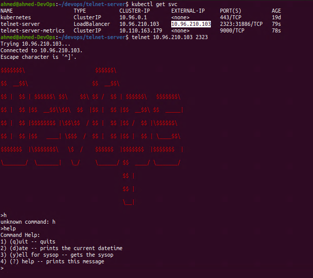
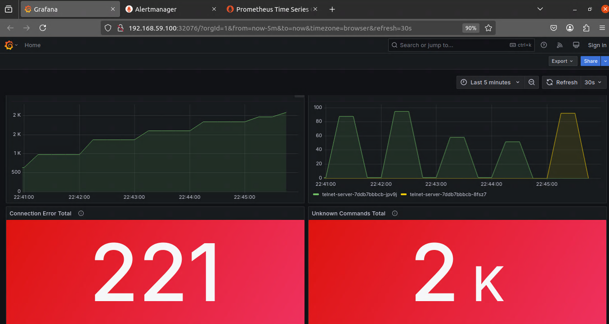

# DevOps Homelab

This github repository contains the setup for a complete DevOps pipeline, combining Vagrant, Ansible, Docker, Kubernetes, and Skaffold for CI/CD automation. It also integrates a monitoring stack with Prometheus, Grafana, and Alertmanager to ensure the health and scalability of the application.

The application `telnet-server` is built in Go and containerized using Docker, while Kubernetes manages deployment and scaling. Skaffold handles the automation of the CI/CD pipeline, and the monitoring stack (Grafana, Prometheus, and Alertmanager) helps track application performance and notify on alerts.

## ⚙️ Setup
### 🛠️ Prerequisites

Make sure you have the minimum system requirements:

- RAM: 8 GB Minimum (16 GB recommended)
- Storage: 50 GB
- Fast internet connection

Now for the project requirements:
- Vagrant (Project tested on `2.4.1`)
- Ansible (Project tested on `core 2.12.10`)
- Virtualbox (Project tested on `Version 6.1.50_Ubuntu`)
- Minikube (Project tested on `minikube version: v1.35.0`)
- container-structure-test (tested on `1.19.3`)
- And for Docker and Kubernetes
```
Client:
 Version:           27.5.1
 API version:       1.47
 Go version:        go1.22.11
 Git commit:        9f9e405
 Built:             Wed Jan 22 13:40:02 2025
 OS/Arch:           linux/amd64
 Context:           default

Server: Docker Engine - Community
 Engine:
  Version:          27.4.0
  API version:      1.47 (minimum version 1.24)
  Go version:       go1.22.10
  Git commit:       92a8393
  Built:            Sat Dec  7 10:39:05 2024
  OS/Arch:          linux/amd64
  Experimental:     false
 containerd:
  Version:          v1.7.23
  GitCommit:        57f17b0a6295a39009d861b89e3b3b87b005ca27
 runc:
  Version:          1.2.3
  GitCommit:        0d37cfd4b557771e555a184d5a78d0ed4bdb79a5
 docker-init:
  Version:          0.19.0
  GitCommit:        de40ad0
```

### 🖥️ Creating and Provisioning the Ubuntu VM

You can create and provision the Ubuntu VM using Vagrant and Ansible. Please make sure you are in the `/vagrant` directory or the directory where the `Vagrantfile` is located:

```sh
vagrant up
```

The command will create the VM (if not already created) and then provision it using the Ansible playbooks located in the `/ansible` directory.

And if you made changes to the Ansible playbooks, and you want to force provision:

```sh
# If VM is shutdown
vagrant up --provision
# If VM is running
vagrant provision
```

### 🚀 CI/CD Pipeline

Make sure you have these installed (I won't cover how to install them):

- Minikube (contains the Docker Engine and Kubernetes)
- Skaffold (Tested on `v2.14.1`)
- Go (Tested on `go version go1.24.0 linux/amd64`)

First containerize the application:

```sh
docker build -t devops/telnet-server:v1 .
```

Make sure the Minikube is running and setup the environment variables Docker needs to talk to the Docker Server inside the minikube's VM:

```sh
minikube start
eval $(minikube -p minikube docker-env)
```

You need to expose the `LoadBalancer` service to the host to be able to access the `telnet-server` application once deployed in the Kubernetes cluster:

```sh
minikube tunnel
```

The kubernetes client that comes with minikube requires us to always use the `minikube kubectl` prefix. It won't work for skaffold (the next step), so we'll create a symbolic link to be able to directly use `kubectl` without the `minikube` prefix:

```sh
ln -s $(which minikube) /usr/local/bin/kubectl
```

Now for the pipeline building step using Skaffold. Make sure you are located in the `/devops/telnet-server` directory which is the application's directory and where the `skaffold.yaml` file is located. `--cleanup=false` basically means when the skaffold process is terminated the created Kubernetes cluster won't be cleaned automatically.

```sh
skaffold dev --cleanup=false
```

Grab the external IP of the service, then connect to the server:

```sh
kubectl get svc
telnet <EXTERNAL-IP> 2323
```



### 📊 Monitoring

Install the monitoring stack:

```sh
kubernetes apply -R -f monitoring/
```

Then you can open the dashboards of Grafana, Prometheus and Alert Manager in your default browser:

```sh
minikube -n monitoring service --all
|------------|----------------------|-------------------|-----------------------------|
| NAMESPACE  |         NAME         |    TARGET PORT    |             URL             |
|------------|----------------------|-------------------|-----------------------------|
| monitoring | alertmanager-service | alertmanager/9093 | http://192.168.59.100:31985 |
|------------|----------------------|-------------------|-----------------------------|
|------------|-----------------|-------------|-----------------------------|
| NAMESPACE  |      NAME       | TARGET PORT |             URL             |
|------------|-----------------|-------------|-----------------------------|
| monitoring | grafana-service |        3000 | http://192.168.59.100:32076 |
|------------|-----------------|-------------|-----------------------------|
|------------|--------------------|-------------|-----------------------------|
| NAMESPACE  |        NAME        | TARGET PORT |             URL             |
|------------|--------------------|-------------|-----------------------------|
| monitoring | prometheus-service |        9090 | http://192.168.59.100:30496 |
|------------|--------------------|-------------|-----------------------------|
  Opening service monitoring/alertmanager-service in default browser...
  Opening service monitoring/grafana-service in default browser...
  Opening service monitoring/prometheus-service in default browser...
```



## 💬 Contact

You can find me in:
- personal website: https://ahmouden.com
- email: ahmouden@proton.me
- linkedin: https://linkedin.com/in/ahmed-elmouden

